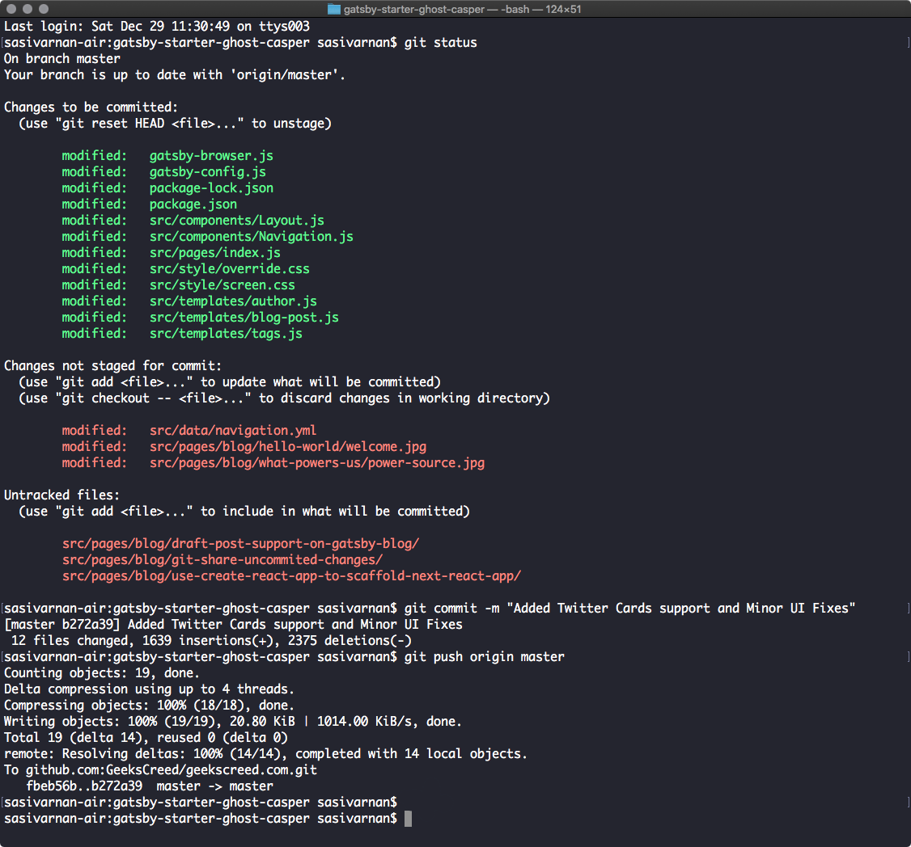

Git is the most popular version control system used to manage projects with multiple people working on it. 

It's distributive nature enables developers to work on the projects without worrying about the availability of network or a central server. 

A typical git workflow will be like

* Make the required changes. 
* `commit` those changes.
* `push` them to the remote.



What if you have some pending changes which you don't want to commit but have to share them to others / share it to another machine? Let's find out.

Run the following command in your source git repo with the pending changes.

```bash
  git diff > changes.patch
```

This will create a file called `changes.patch` which contains diff of pending changes.

**Note:** This will work only in `linux` or `mac` machines. To make these commands work in `windows`, use `Git Bash`, which comes along with git installation.

The above command will create a patch of files which are already tracked. In order to create a patch with the untracked files, first stage those files using `git add .` command and then run,

```bash
  git diff --cached > changes.patch
```

If your repo contains binary files such as images and audio, in order to add them to your patch, stage them first and run,

```bash
  git diff --cached --binary > changes.patch
```

Now share that `changes.patch` file to your target repo and run,

```bash
  git apply changes.patch
```

Voila 🎉, your uncommitted changes of your source repo are now available in your target repo.

Hope you will incorporate this in your daily git workflow. 

Feel free to share your thoughts on the comment section below.